# Voz del Ciudadano

Plataforma digital para el registro y procesamiento de iniciativas legislativas ciudadanas.

## Objetivo
Permitir que colectivos civiles creen propuestas normativas, reciban comentarios, modificaciones, recursos de soporte y firmas digitales. Cuando una iniciativa alcanza 25,000 firmas válidas dentro del plazo máximo de 90 días, el sistema la congela criptográficamente y la envía a la Oficina del Congreso para su distribución a las comisiones parlamentarias.

## Requisitos funcionales

1. El sistema debe permitir registrar una iniciativa con título, resumen, colectivo proponente y materia.
2. El sistema debe permitir registrar firmas digitales válidas de ciudadanos.
3. El sistema debe rechazar firmas duplicadas para el mismo DNI dentro de la misma iniciativa.
4. El sistema debe permitir agregar comentarios sobre la propuesta.
5. El sistema debe permitir registrar modificaciones o versiones mejoradas del texto normativo.
6. El sistema debe permitir adjuntar recursos de soporte como actas, documentos o enlaces.
7. El sistema debe controlar un plazo máximo de 90 días para la recolección de firmas.
8. El sistema debe congelar criptográficamente la iniciativa cuando alcance 25,000 firmas válidas y siga dentro del plazo.
9. El sistema debe generar un hash de congelamiento para evidenciar integridad del archivo.
10. El sistema debe enviar la iniciativa congelada a la Oficina del Congreso para su distribución a comisiones parlamentarias.
11. El sistema debe asignar comisiones según la materia de la iniciativa.
12. El sistema debe impedir cambios cuando la iniciativa ya fue congelada o venció el plazo.
13. El sistema debe mostrar el estado de cada iniciativa.

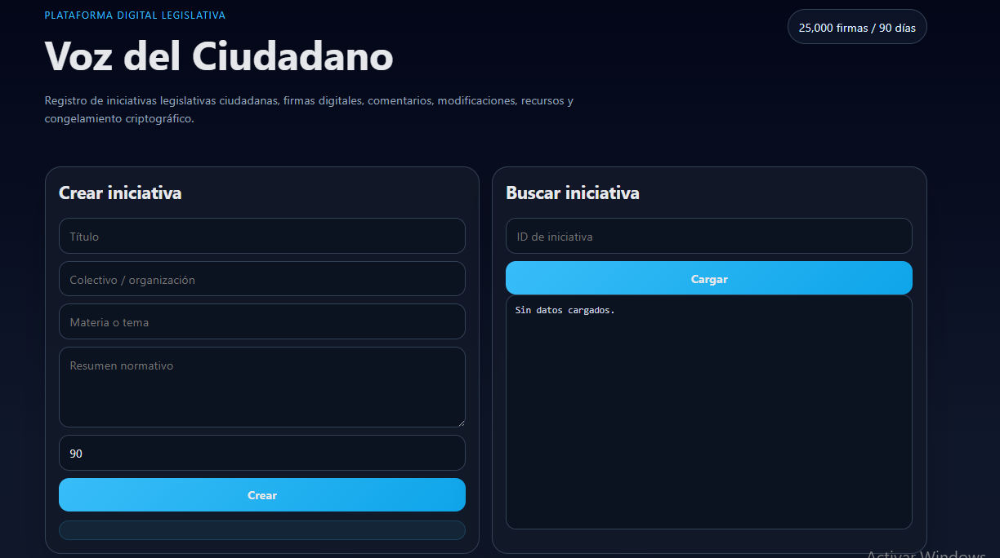


## Casos de uso

### CU-01 Crear iniciativa
Actor: Colectivo ciudadano.
Flujo: ingresa datos de la propuesta, el sistema genera un identificador, fecha de creación y fecha límite.

### CU-02 Registrar firma
Actor: Ciudadano.
Flujo: ingresa nombre, DNI y distrito; el sistema valida el formato, evita duplicados y almacena la firma.

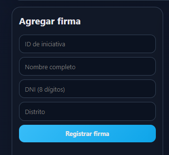

### CU-03 Agregar comentario
Actor: Ciudadano u observador.
Flujo: envía un comentario de apoyo o revisión.

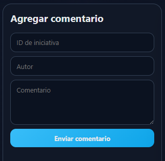

### CU-04 Agregar modificación
Actor: Colectivo ciudadano.
Flujo: incorpora ajustes al texto normativo mientras la iniciativa esté abierta.

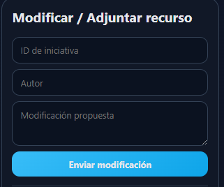

### CU-05 Adjuntar recurso
Actor: Colectivo ciudadano.
Flujo: sube o enlaza documentos de soporte.

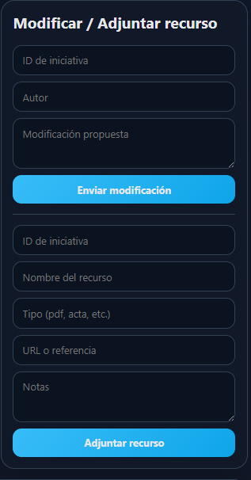

### CU-06 Congelar criptográficamente
Actor: Sistema.
Flujo: al llegar al umbral de firmas válidas, calcula el hash de integridad y bloquea la iniciativa.


### CU-07 Enviar al Congreso
Actor: Sistema.
Flujo: luego del congelamiento, remite la iniciativa a la Oficina del Congreso y asigna comisiones.

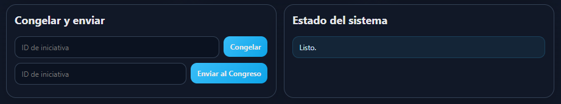

## Historias de usuario: 

- Como colectivo ciudadano, quiero crear una iniciativa para iniciar la recolección de firmas.
- Como ciudadano, quiero firmar una propuesta para mostrar apoyo verificable.
- Como asesor, quiero añadir comentarios y modificaciones para mejorar la redacción.
- Como sistema, quiero congelar el archivo automáticamente cuando se cumplan las reglas constitucionales.
- Como personal del Congreso, quiero recibir el expediente distribuido por comisiones según la materia.

## Patrones estructurales usados

- Facade: `LegislativeInitiativeFacade` centraliza la orquestación de casos de uso.
- Proxy: `CryptographicFreezeProxy` controla el acceso al congelamiento criptográfico.
- Adapter: `CivilRegistryValidationAdapter` normaliza la validación externa de firmas.
- Decorator: `ChecksumDecorator` y `EvidenceMetadataDecorator` agregan metadatos a los recursos.

## Casos de prueba

1. Crear una iniciativa correctamente.

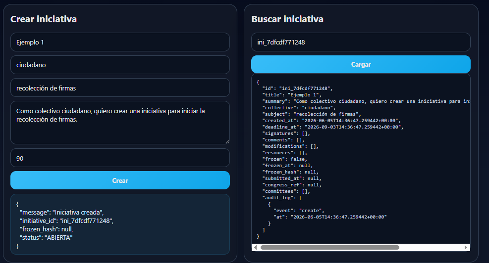

2. Registrar una firma válida.

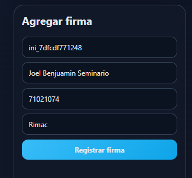

3. Rechazar una firma duplicada.

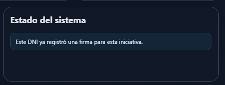

4. Evitar congelar sin alcanzar el umbral mínimo.

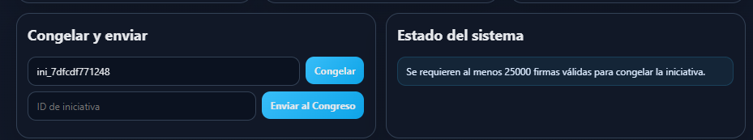

5. Congelar y luego enviar al Congreso.
6. Rechazar modificaciones cuando la iniciativa venció.
7. Verificar que el hash de congelamiento se genere.
8. Verificar que la distribución por comisiones responda al tema.

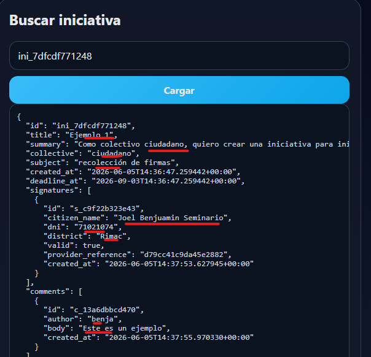

## Pruebas automatizadas

Cada punto (.) representa una prueba exitosa.

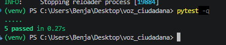


## Ejecución

Instalar dependencias:

```bash
pip install -r requirements.txt
```

Levantar la aplicación:

```bash
uvicorn app.main:app --reload
```

Abrir en el navegador:

```bash
http://127.0.0.1:8000
```

Ejecutar pruebas:

```bash
pytest -q
```

## Estructura

```text
voz_ciudadana/
├─ app/
│  ├─ adapters.py
│  ├─ decorators.py
│  ├─ domain.py
│  ├─ facade.py
│  ├─ main.py
│  ├─ repository.py
│  └─ schemas.py
├─ static/
│  ├─ app.js
│  └─ style.css
├─ templates/
│  └─ index.html
├─ tests/
│  └─ test_service.py
├─ requirements.txt
└─ README.md
```
